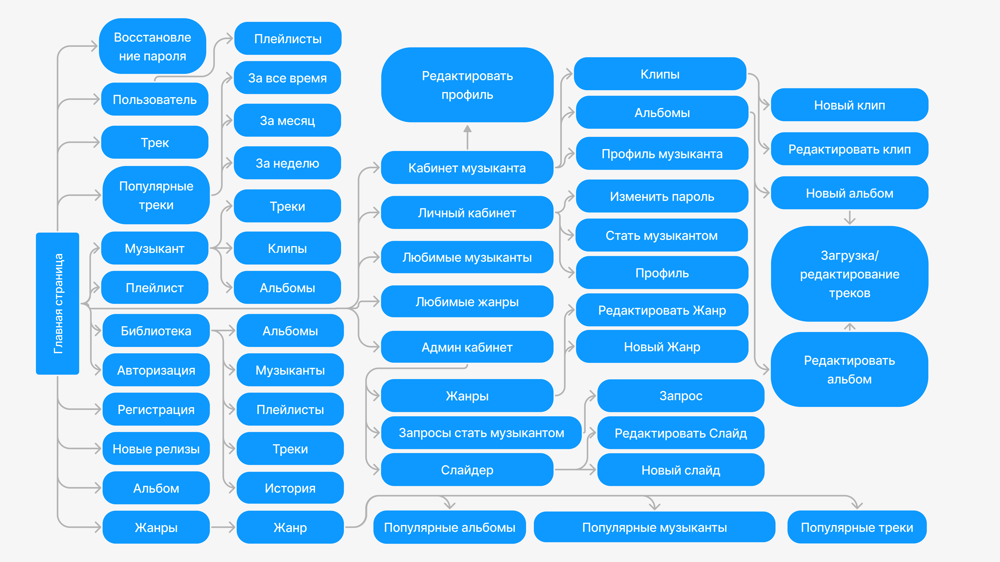

<h1>Cкриншоты сайта</h1>

## [Главная страница](/docs/home/README.md)

## [Библиотека](/docs/library/README.md)

## [Страница жанра](/docs/genre/README.md)

## [Поиск](/docs/search/README.md)

## [Кабинет администратора](/docs/admin-cabinet/README.md)

## [Кабинет музыканта](/docs/musician-cabinet/README.md)

## [Авторизация](/docs/login/README.md)

## [Регистрация](/docs/register/README.md)

## [Плейлист](/docs/playlist/README.md)

## [Альбом](/docs/album/README.md)

## ER диаграмма базы данных

## Структура сайта

<h1>Настройка</h1>

<h3>Зависимости</h3>

    - Python 3.10
    - ffmpeg
    - PostgreSQL

<h3>Установка</h3>

    cd backend
    pip install -r reqirements.txt

    cd ..

    cd frontend
    npm i

<h3>Настройка</h3>

Создайте файл .env.local в корневой папке с следующим содержимым

    DB_NAME=*****
    DB_USER=*****
    DB_PASSWORD=*****
    DB_PORT=5432
    DB_HOST=localhost

<h3>Запуск</h3>

<h4>backend</h4>

    uvicorn backend.main:app --host localhost

<h4>frontend</h4>

Запускать только после запуска backend (делается запрос для генерации клиента API)

    npm run dev
