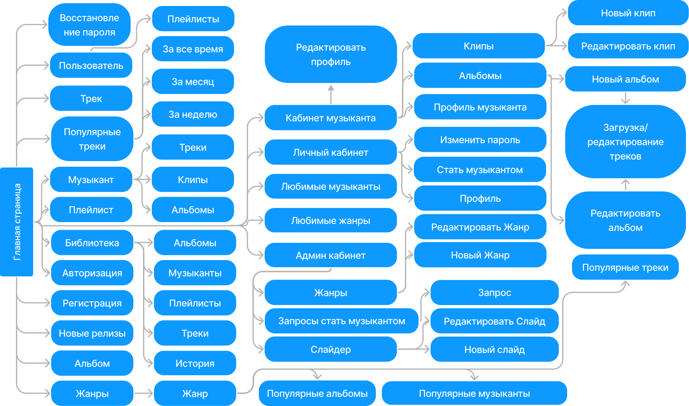
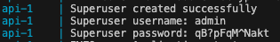

<h1>Cкриншоты сайта</h1>

## [Главная страница](/docs/home/README.md)

## [Библиотека](/docs/library/README.md)

## [Страница жанра](/docs/genre/README.md)

## [Поиск](/docs/search/README.md)

## [Кабинет администратора](/docs/admin-cabinet/README.md)

## [Кабинет музыканта](/docs/musician-cabinet/README.md)

## [Авторизация](/docs/login/README.md)

## [Регистрация](/docs/register/README.md)

## [Плейлист](/docs/playlist/README.md)

## [Альбом](/docs/album/README.md)

## ER диаграмма базы данных

## Структура сайта

<h1>Запуск проекта</h1>

<h3>Переменные окружения</h3>

Создайте файл `.env.local` в корневой папке с следующим содержимым

    POSTGRES_DB=*****
    POSTGRES_PASSWORD=*****
    POSTGRES_PASSWORD=*****
    POSTGRES_PORT=5432
    POSTGRES_HOST=db

<h3>Запуск в режиме production</h3>

    docker-compose build
    docker-compose up

Сайт будет доступен по адресу `http://localhost:8080`

При первом запуске в консоли напишет логин и пароль администратора

<h1>Локальная разработка</h1>

<h3>Переменные окружения</h3>

Создайте файл `.env.dev.local` в корневой папке с следующим содержимым

    POSTGRES_DB=*****
    POSTGRES_PASSWORD=*****
    POSTGRES_PASSWORD=*****
    POSTGRES_PORT=*****
    POSTGRES_HOST=db (для postgres в docker-compose)

<h3>Запуск в режиме разработки</h3>

Будет запущено только API

<h4>backend</h4>

    docker-compose -f docker-compose.dev.yml up

API будет доступно по адресу `http://localhost:8000`

<h4>frontend</h4>
    
    npm run dev

После изменения конечных точек API сгенерируйте API-клиент (backend должен быть запущен в режиме разработки)

    cd frontend
    npm run generate-client-dev
